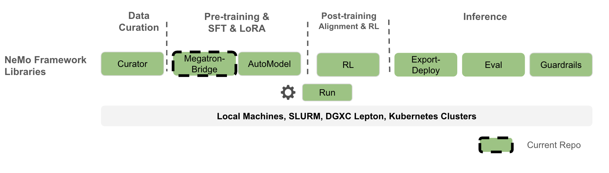

<div align="center">

# NeMo Megatron Bridge

[](https://codecov.io/github/NVIDIA-NeMo/Megatron-Bridge)
[](https://github.com/NVIDIA-NeMo/Megatron-Bridge/actions/workflows/cicd-main.yml)
[](https://www.python.org/downloads/release/python-3100/)
[](https://github.com/NVIDIA-NeMo/Megatron-Bridge/stargazers/)

[Documentation](https://docs.nvidia.com/nemo/megatron-bridge/latest/) | [Supported Models](#supported-models) | [Examples](https://github.com/NVIDIA-NeMo/Megatron-Bridge/tree/main/examples) | [Contributing](https://github.com/NVIDIA-NeMo/Megatron-Bridge/blob/main/CONTRIBUTING.md)
</div>

## 📣 News
* [12/16/2025] [Mind Lab](https://macaron.im/mindlab) successfully used Megatron-bridge and [VeRL](https://github.com/volcengine/verl) to trained GRPO Lora for Trillion-parameter model on 64 H800 - See their [techblog](https://macaron.im/mindlab/research/building-trillion-parameter-reasoning-rl-with-10-gpus).
* [12/15/2025] Day 0 support for [NVIDIA-NeMotron-3-Nano-30B-A3B-FP8](https://huggingface.co/nvidia/NVIDIA-Nemotron-3-Nano-30B-A3B-FP8)! [Reproducible code](https://github.com/NVIDIA-NeMo/Megatron-Bridge/tree/nano-v3) and custom NGC container: [nvcr.io/nvidia/nemo:25.11.nemotron_3_nano](https://catalog.ngc.nvidia.com/orgs/nvidia/containers/nemo?version=25.11.nemotron_3_nano)
* 

## Overview

NeMo Megatron Bridge is a PyTorch-native library within the [NeMo Framework](https://github.com/NVIDIA-NeMo) that provides pretraining, SFT and LoRA for popular LLM and VLM models. It serves as a powerful **bridge, conversion, and verification layer** between 🤗 Hugging Face and [Megatron Core](https://github.com/NVIDIA/Megatron-LM/tree/main/megatron/core). It provides bidirectional checkpoint conversion between these formats, enabling other projects to leverage Megatron Core's parallelism capabilities or export models for various inference engines. The bridge includes built-in verification mechanisms to ensure conversion accuracy and checkpoint integrity across different model formats.

On top of the bridge, NeMo Megatron Bridge provides a performant and scalable PyTorch-native training loop that leverages [Megatron Core](https://github.com/NVIDIA/Megatron-LM/tree/main/megatron/core) to deliver state-of-the-art training throughput. It supports pretraining and fine-tuning with features like tensor and pipeline parallelism, and mixed precision (FP8, BF16, FP4, etc.). Users can either use existing 🤗 Hugging Face models or define custom PyTorch model definitions for flexible end-to-end workflows.

NeMo Megatron Bridge is a refactor of the [previous NeMo](https://github.com/NVIDIA/NeMo) training stack that adopts a PyTorch-native training loop to provide greater flexibility and customizability for developers.



## 🔧 Installation

### 🐳 NeMo Framework container

The best experience, highest performance, and full feature support are provided by the [NeMo Framework container](https://catalog.ngc.nvidia.com/orgs/nvidia/containers/nemo/tags). Fetch the most recent $TAG and run the following to start a container:

```bash
docker run --rm -it -w /workdir -v $(pwd):/workdir \
  --entrypoint bash \
  --gpus all \
  nvcr.io/nvidia/nemo:${TAG}
```

### 📦 Local Installation with UV

Install from PyPI using [uv](https://docs.astral.sh/uv/):

```bash
# Install uv if not already installed
curl -LsSf https://astral.sh/uv/install.sh | sh

# Install Megatron Bridge
uv pip install megatron-bridge
```

**Optional dependencies:**
```bash
# For Mamba model architectures
uv pip install "megatron-bridge[mamba]"

# For NeMo Run recipes
uv pip install "megatron-bridge[recipes]"
```

**Development installation:**
```bash
# Clone and install in editable mode
git clone https://github.com/NVIDIA-NeMo/Megatron-Bridge.git
cd Megatron-Bridge
uv pip install -e .
```

> **Note:** Installation requires Python development headers (`sudo apt-get install python3-dev`). The base installation includes `transformer-engine` which takes ~10 minutes to build from source. Installing `[mamba]` extras adds `mamba-ssm` and `causal-conv1d` which take an additional ~27 minutes to build.

For additional details, please refer to our [Contribution guide](https://github.com/NVIDIA-NeMo/Megatron-Bridge/blob/main/CONTRIBUTING.md).

## ⚡ Quickstart

To get started, install Megatron Bridge or download a NeMo Framework container as described [above](#-installation).

Log in to Hugging Face Hub:

```sh
huggingface-cli login --token <your token>
```

Conversion-only quickstart (✅ Core):

```python
from megatron.bridge import AutoBridge

# 1) Create a bridge from a Hugging Face model (hub or local path)
bridge = AutoBridge.from_hf_pretrained("meta-llama/Llama-3.2-1B", trust_remote_code=True)

# 2) Get a Megatron provider and configure parallelism before instantiation
provider = bridge.to_megatron_provider()
provider.tensor_model_parallel_size = 1
provider.pipeline_model_parallel_size = 1
provider.finalize()
# 3) Materialize Megatron Core model(s)
model = provider.provide_distributed_model(wrap_with_ddp=False)

# 4a) Export Megatron → Hugging Face (full HF folder with config/tokenizer/weights)
bridge.save_hf_pretrained(model, "./hf_exports/llama32_1b")

# 4b) Or stream only weights (Megatron → HF)
for name, weight in bridge.export_hf_weights(model, cpu=True):
    print(name, tuple(weight.shape))
```

Training quickstart using pre-configured recipes:

```python
from megatron.bridge.recipes.llama import llama32_1b_pretrain_config
from megatron.bridge.training.gpt_step import forward_step
from megatron.bridge.training.pretrain import pretrain

if __name__ == "__main__":
    # The recipe uses the Llama 3.2 1B model configuration from HuggingFace
    cfg = llama32_1b_pretrain_config(seq_length=1024)

    # Override training parameters
    cfg.train.train_iters = 10
    cfg.scheduler.lr_decay_iters = 10000
    cfg.model.vocab_size = 8192
    cfg.tokenizer.vocab_size = cfg.model.vocab_size

    pretrain(cfg, forward_step)
```

You can launch the above script with:

```sh
torchrun --nproc-per-node=<num devices> /path/to/script.py
```

More examples:

- [Conversion scripts overview](https://github.com/NVIDIA-NeMo/Megatron-Bridge/blob/main/examples/conversion/README.md)
- [Import/Export checkpoints](https://github.com/NVIDIA-NeMo/Megatron-Bridge/blob/main/examples/conversion/convert_checkpoints.py)
- [Generation with bridge](https://github.com/NVIDIA-NeMo/Megatron-Bridge/blob/main/examples/conversion/hf_to_megatron_generate_text.py)
- [Multi-GPU loading from HF](https://github.com/NVIDIA-NeMo/Megatron-Bridge/blob/main/examples/conversion/hf_megatron_roundtrip_multi_gpu.py)
- [Compare HF vs Megatron outputs](https://github.com/NVIDIA-NeMo/Megatron-Bridge/blob/main/examples/conversion/compare_models.py)
- [Toy RLHF with Bridge (HF inference + Megatron training)](https://github.com/NVIDIA-NeMo/Megatron-Bridge/blob/main/examples/rl/rlhf_with_bridge.py)

For a deeper dive into conversion design and advanced usage, see the [models README](https://github.com/NVIDIA-NeMo/Megatron-Bridge/blob/main/src/megatron/bridge/models/README.md).

## 🚀 Key Features

- **Bridge with 🤗 Hugging Face**: Seamless bidirectional conversion between 🤗 Hugging Face and Megatron formats for interoperability ([model bridges](https://github.com/NVIDIA-NeMo/Megatron-Bridge/tree/main/src/megatron/bridge/models), [auto bridge](https://github.com/NVIDIA-NeMo/Megatron-Bridge/blob/main/src/megatron/bridge/models/conversion/auto_bridge.py), [conversion examples](https://github.com/NVIDIA-NeMo/Megatron-Bridge/tree/main/examples/conversion))
  - Online import/export without intermediate full checkpoints
  - Parallelism-aware (TP/PP/VPP/CP/EP/ETP) during conversion
  - Memory-efficient per-parameter streaming
  - Simple high-level `AutoBridge` API with architecture auto-detection
  - Optimized paths when Transformer Engine is available
- **Flexible to Customize**: Lightweight custom training loop making it easy to configure custom logic in data loading, distributed training, checkpointing, evaluation and logging ([training framework](https://github.com/NVIDIA-NeMo/Megatron-Bridge/tree/main/src/megatron/bridge/training), [training utilities](https://github.com/NVIDIA-NeMo/Megatron-Bridge/tree/main/src/megatron/bridge/training/utils))
- **Supervised & Parameter-Efficient Finetuning**: SFT & PEFT implementation tailored for Megatron-based models that supports LoRA, DoRA, and user-defined PEFT methods ([PEFT implementations](https://github.com/NVIDIA-NeMo/Megatron-Bridge/tree/main/src/megatron/bridge/peft), [finetune module](https://github.com/NVIDIA-NeMo/Megatron-Bridge/blob/main/src/megatron/bridge/training/finetune.py), [SFT dataset](https://github.com/NVIDIA-NeMo/Megatron-Bridge/blob/main/src/megatron/bridge/data/datasets/sft.py))
- **SOTA Training Recipes**: Pre-configured production-ready training recipes for popular models like Llama 3, with optimized hyperparameters and distributed training configuration ([Llama recipes](https://github.com/NVIDIA-NeMo/Megatron-Bridge/tree/main/src/megatron/bridge/recipes/llama), [recipe examples](https://github.com/NVIDIA-NeMo/Megatron-Bridge/tree/main/examples/recipes))
- **Performance Optimization**: Built-in support for FP8 training, model parallelism, and memory-efficient techniques to offer high utilization and near-linear scalability to thousands of nodes. ([mixed precision](https://github.com/NVIDIA-NeMo/Megatron-Bridge/blob/main/src/megatron/bridge/training/mixed_precision.py), [communication overlap](https://github.com/NVIDIA-NeMo/Megatron-Bridge/blob/main/src/megatron/bridge/training/comm_overlap.py), [optimizer utilities](https://github.com/NVIDIA-NeMo/Megatron-Bridge/blob/main/src/megatron/bridge/recipes/utils/optimizer_utils.py))

## Supported Models

Megatron Bridge provides out-of-the-box bridges and training recipes for a wide range of models, built on top of base model architectures from [Megatron Core](https://github.com/NVIDIA/Megatron-LM/tree/main/megatron/core). Refer to the [models directory](https://github.com/NVIDIA-NeMo/Megatron-Bridge/tree/main/src/megatron/bridge/models) for the most up-to-date list of model bridges.

### Supported Models Overview

For more details on supported models, see our documentation:
- **[Large Language Models](https://docs.nvidia.com/nemo/megatron-bridge/latest/models/llm/index.html)**
- **[Vision Language Models](https://docs.nvidia.com/nemo/megatron-bridge/latest/models/vlm/index.html)**

| Model | Checkpoint Conversion | Pretrain Recipes | SFT & LoRA Recipes |
|-------|-------------------|-------------------|-------------------|
| [DeepSeek V2](https://github.com/NVIDIA-NeMo/Megatron-Bridge/tree/main/src/megatron/bridge/models/deepseek) | ✅ | ✅ ([v2](https://github.com/NVIDIA-NeMo/Megatron-Bridge/blob/main/src/megatron/bridge/recipes/deepseek/deepseek_v2.py)) | Coming soon |
| [DeepSeek V2 Lite](https://github.com/NVIDIA-NeMo/Megatron-Bridge/tree/main/src/megatron/bridge/models/deepseek) | ✅ | ✅ ([v2-lite](https://github.com/NVIDIA-NeMo/Megatron-Bridge/blob/main/src/megatron/bridge/recipes/deepseek/deepseek_v2.py)) | Coming soon |
| [DeepSeek V3](https://github.com/NVIDIA-NeMo/Megatron-Bridge/tree/main/src/megatron/bridge/models/deepseek) | ✅ | ✅ ([v3](https://github.com/NVIDIA-NeMo/Megatron-Bridge/blob/main/src/megatron/bridge/recipes/deepseek/deepseek_v3.py)) | Coming soon |
| [Gemma](https://github.com/NVIDIA-NeMo/Megatron-Bridge/tree/main/src/megatron/bridge/models/gemma) | ✅ | Coming soon | Coming soon |
| [Gemma 2](https://github.com/NVIDIA-NeMo/Megatron-Bridge/tree/main/src/megatron/bridge/models/gemma) | ✅ | Coming soon | Coming soon |
| [Gemma 3](https://github.com/NVIDIA-NeMo/Megatron-Bridge/tree/main/src/megatron/bridge/models/gemma) | ✅ | ✅ ([1B](https://github.com/NVIDIA-NeMo/Megatron-Bridge/blob/main/src/megatron/bridge/recipes/gemma/gemma3.py)) | ✅ ([1B](https://github.com/NVIDIA-NeMo/Megatron-Bridge/blob/main/src/megatron/bridge/recipes/gemma/gemma3.py)) |
| [Gemma 3-VL](https://github.com/NVIDIA-NeMo/Megatron-Bridge/tree/main/src/megatron/bridge/models/gemma_vl) | ✅ | Coming soon | ✅ ([4B/12B/27B](https://github.com/NVIDIA-NeMo/Megatron-Bridge/blob/main/src/megatron/bridge/recipes/gemma3_vl/gemma3_vl.py)) |
| [GLM-4.5](https://github.com/NVIDIA-NeMo/Megatron-Bridge/tree/main/src/megatron/bridge/models/glm) | ✅ | ✅ ([106B-Air/355B](https://github.com/NVIDIA-NeMo/Megatron-Bridge/blob/main/src/megatron/bridge/recipes/glm/glm45.py)) | ✅ ([106B-Air/355B](https://github.com/NVIDIA-NeMo/Megatron-Bridge/blob/main/src/megatron/bridge/recipes/glm/glm45.py)) |
| [GPT-oss](https://github.com/NVIDIA-NeMo/Megatron-Bridge/tree/main/src/megatron/bridge/models/gpt_oss) | ✅ | ✅ ([20B/120B](https://github.com/NVIDIA-NeMo/Megatron-Bridge/blob/main/src/megatron/bridge/recipes/gpt_oss/gpt_oss.py)) | ✅ ([20B/120B](https://github.com/NVIDIA-NeMo/Megatron-Bridge/blob/main/src/megatron/bridge/recipes/gpt_oss/gpt_oss.py)) |
| [Llama 2](https://github.com/NVIDIA-NeMo/Megatron-Bridge/tree/main/src/megatron/bridge/models/llama) | ✅ | ✅ ([7B](https://github.com/NVIDIA-NeMo/Megatron-Bridge/blob/main/src/megatron/bridge/recipes/llama/llama2.py)) | Coming soon |
| [Llama 3](https://github.com/NVIDIA-NeMo/Megatron-Bridge/tree/main/src/megatron/bridge/models/llama) | ✅ | ✅ ([8B/70B](https://github.com/NVIDIA-NeMo/Megatron-Bridge/blob/main/src/megatron/bridge/recipes/llama/llama3.py)) | ✅ ([8B/70B](https://github.com/NVIDIA-NeMo/Megatron-Bridge/blob/main/src/megatron/bridge/recipes/llama/llama3.py)) |
| [Llama 3.1](https://github.com/NVIDIA-NeMo/Megatron-Bridge/tree/main/src/megatron/bridge/models/llama) | ✅ | ✅ ([8B/70B/405B](https://github.com/NVIDIA-NeMo/Megatron-Bridge/blob/main/src/megatron/bridge/recipes/llama/llama3.py)) | ✅ ([8B/70B/405B](https://github.com/NVIDIA-NeMo/Megatron-Bridge/blob/main/src/megatron/bridge/recipes/llama/llama3.py)) |
| [Llama 3.2](https://github.com/NVIDIA-NeMo/Megatron-Bridge/tree/main/src/megatron/bridge/models/llama) | ✅ | ✅ ([1B/3B](https://github.com/NVIDIA-NeMo/Megatron-Bridge/blob/main/src/megatron/bridge/recipes/llama/llama3.py)) | ✅ ([1B/3B](https://github.com/NVIDIA-NeMo/Megatron-Bridge/blob/main/src/megatron/bridge/recipes/llama/llama3.py)) |
| [Llama 3.3](https://github.com/NVIDIA-NeMo/Megatron-Bridge/tree/main/src/megatron/bridge/models/llama) | ✅ | Coming soon | Coming soon |
| [Llama Nemotron](https://github.com/NVIDIA-NeMo/Megatron-Bridge/tree/main/src/megatron/bridge/models/llama_nemotron) | ✅ | Coming soon | Coming soon |
| [Mistral](https://github.com/NVIDIA-NeMo/Megatron-Bridge/tree/main/src/megatron/bridge/models/mistral) | ✅ | Coming soon | Coming soon |
|[Ministral](https://github.com/NVIDIA-NeMo/Megatron-Bridge/tree/main/src/megatron/bridge/models/ministral3)| ✅| ✅ [3B/8B/14B](https://github.com/NVIDIA-NeMo/Megatron-Bridge/blob/main/src/megatron/bridge/recipes/ministral3/ministral3.py)|✅ [3B/8B/14B](https://github.com/NVIDIA-NeMo/Megatron-Bridge/blob/main/src/megatron/bridge/recipes/ministral3/ministral3.py)|
| [Moonlight](https://github.com/NVIDIA-NeMo/Megatron-Bridge/tree/main/src/megatron/bridge/models/deepseek) | ✅ | ✅ ([16B](https://github.com/NVIDIA-NeMo/Megatron-Bridge/blob/main/src/megatron/bridge/recipes/moonlight/moonlight_16b.py)) | ✅ ([16B](https://github.com/NVIDIA-NeMo/Megatron-Bridge/blob/main/src/megatron/bridge/recipes/moonlight/moonlight_16b.py)) |
| [Nemotron](https://github.com/NVIDIA-NeMo/Megatron-Bridge/tree/main/src/megatron/bridge/models/nemotron) | ✅ | Coming soon | Coming soon |
| [Nemotron-3](https://github.com/NVIDIA-NeMo/Megatron-Bridge/tree/nano-v3/src/megatron/bridge/models/nemotronh) | ✅ | ✅ ([A3B](https://github.com/NVIDIA-NeMo/Megatron-Bridge/blob/nano-v3/src/megatron/bridge/recipes/nemotronh/nemotron_3_nano.py)) | ✅ ([A3B](https://github.com/NVIDIA-NeMo/Megatron-Bridge/blob/nano-v3/src/megatron/bridge/recipes/nemotronh/nemotron_3_nano.py)) |
| [Nemotron-H](https://github.com/NVIDIA-NeMo/Megatron-Bridge/tree/main/src/megatron/bridge/models/nemotronh) | ✅ | ✅ ([4B/8B/47B/56B](https://github.com/NVIDIA-NeMo/Megatron-Bridge/blob/main/src/megatron/bridge/recipes/nemotronh/nemotronh.py)) | Coming soon |
| [Nemotron Nano v2](https://github.com/NVIDIA-NeMo/Megatron-Bridge/tree/main/src/megatron/bridge/models/nemotronh) | ✅ | ✅ ([9B/12B](https://github.com/NVIDIA-NeMo/Megatron-Bridge/blob/main/src/megatron/bridge/recipes/nemotronh/nemotron_nano_v2.py)) | Coming soon |
| [Nemotron Nano v2 VL](https://github.com/NVIDIA-NeMo/Megatron-Bridge/tree/main/src/megatron/bridge/models/nemotron_vl) | ✅ | Coming soon | ✅ ([9B/12B](https://github.com/NVIDIA-NeMo/Megatron-Bridge/blob/main/src/megatron/bridge/recipes/nemotron_vl/nemotron_nano_v2_vl.py)) |
| [OlMoE](https://github.com/NVIDIA-NeMo/Megatron-Bridge/tree/main/src/megatron/bridge/models/olmoe) | ✅ | ✅ ([7B](https://github.com/NVIDIA-NeMo/Megatron-Bridge/blob/main/src/megatron/bridge/recipes/olmoe/olmoe_7b.py)) | ✅ ([7B](https://github.com/NVIDIA-NeMo/Megatron-Bridge/blob/main/src/megatron/bridge/recipes/olmoe/olmoe_7b.py)) |
| [Qwen2](https://github.com/NVIDIA-NeMo/Megatron-Bridge/tree/main/src/megatron/bridge/models/qwen) | ✅ | ✅ ([500M/1.5B/7B/72B](https://github.com/NVIDIA-NeMo/Megatron-Bridge/blob/main/src/megatron/bridge/recipes/qwen/qwen2.py)) | ✅ ([500M/1.5B/7B/72B](https://github.com/NVIDIA-NeMo/Megatron-Bridge/blob/main/src/megatron/bridge/recipes/qwen/qwen2.py)) |
| [Qwen2.5](https://github.com/NVIDIA-NeMo/Megatron-Bridge/tree/main/src/megatron/bridge/models/qwen) | ✅ | ✅ ([500M/1.5B/7B/14B/32B/72B](https://github.com/NVIDIA-NeMo/Megatron-Bridge/blob/main/src/megatron/bridge/recipes/qwen/qwen2.py)) | ✅ ([500M/1.5B/7B/14B/32B/72B](https://github.com/NVIDIA-NeMo/Megatron-Bridge/blob/main/src/megatron/bridge/recipes/qwen/qwen2.py)) |
| [Qwen2.5-VL](https://github.com/NVIDIA-NeMo/Megatron-Bridge/tree/main/src/megatron/bridge/models/qwen_vl) | ✅ | Coming soon | ✅ ([3B/7B/32B/72B](https://github.com/NVIDIA-NeMo/Megatron-Bridge/blob/main/src/megatron/bridge/recipes/qwen_vl/qwen25_vl.py)) |
| [Qwen3](https://github.com/NVIDIA-NeMo/Megatron-Bridge/tree/main/src/megatron/bridge/models/qwen) | ✅ | ✅ ([600M/1.7B/4B/8B/14B/32B](https://github.com/NVIDIA-NeMo/Megatron-Bridge/blob/main/src/megatron/bridge/recipes/qwen/qwen3.py)) | ✅ ([600M/1.7B/4B/8B/14B/32B](https://github.com/NVIDIA-NeMo/Megatron-Bridge/blob/main/src/megatron/bridge/recipes/qwen/qwen3.py)) |
| [Qwen3-MoE](https://github.com/NVIDIA-NeMo/Megatron-Bridge/tree/main/src/megatron/bridge/models/qwen) | ✅ | ✅ ([A3B/A22B](https://github.com/NVIDIA-NeMo/Megatron-Bridge/blob/main/src/megatron/bridge/recipes/qwen/qwen3_moe.py)) | ✅ ([A3B/A22B](https://github.com/NVIDIA-NeMo/Megatron-Bridge/blob/main/src/megatron/bridge/recipes/qwen/qwen3_moe.py)) |
| [Qwen3 Next](https://github.com/NVIDIA-NeMo/Megatron-Bridge/tree/main/src/megatron/bridge/models/qwen) | ✅ | ✅ ([80B-A3B](https://github.com/NVIDIA-NeMo/Megatron-Bridge/blob/main/src/megatron/bridge/recipes/qwen/qwen3_next.py)) | ✅ ([80B-A3B](https://github.com/NVIDIA-NeMo/Megatron-Bridge/blob/main/src/megatron/bridge/recipes/qwen/qwen3_next.py)) |
| [Qwen3-VL](https://github.com/NVIDIA-NeMo/Megatron-Bridge/tree/main/src/megatron/bridge/models/qwen_vl) | ✅ | Coming soon | ✅ ([8B/A3B-A30B-MoE](https://github.com/NVIDIA-NeMo/Megatron-Bridge/blob/main/src/megatron/bridge/recipes/qwen_vl/qwen3vl.py)) |

#### Launching Recipes

For a conceptual overview of how recipes are structured, overridden, and launched with either `torchrun` or NeMo-Run, read the [Using Recipes guide](https://docs.nvidia.com/nemo/megatron-bridge/latest/recipe-usage.html).

Runnable tutorials live in `tutorials/recipes/llama` that covers:

- `00_quickstart_pretrain.py` for mock-data pretraining
- `01_quickstart_finetune.py` + LoRA configs
- YAML-driven flows and launch helpers

<!-- ### Vision-Language Models -->

## Performance Benchmarks

For detailed performance benchmarks including throughput metrics across different GPU systems (DGX-GB200, DGX-B200, DGX-H100) and model configurations, see the [Performance Summary](https://docs.nvidia.com/nemo/megatron-bridge/latest/performance-summary.html) in our documentation.

## Project Structure

```
Megatron-Bridge/
├── examples/
│   ├── models/                  # Bridge usage examples
│   └── recipes/                 # Training examples
├── src/megatron/bridge/
│   ├── data/                    # Dataloaders and iterators
│   ├── models/                  # Hugging Face bridge infrastructure and model-specific implementations
│   │   ├── llama/               # Llama model providers
│   │   └── .../                 # Other models (gpt, t5, etc.)
│   ├── peft/                    # PEFT transformations and wrappers
│   ├── recipes/                 # Complete training recipes
│   ├── training/                # Training loop components
│   │   ├── tokenizers/          # Tokenizer library
│   │   └── utils/               # Training-specific utilities
│   └── utils/                   # Generic utilities for repo-wide usage
└── tests/                       # Comprehensive test suite
```

## Acknowledgement & Contributing

Megatron-Bridge is the continuation of [MBridge](https://github.com/ISEEKYAN/mbridge) by [Yan Bai](https://github.com/ISEEKYAN). We appreciate all the contribution and adoptions by the community partners:

- [Mind Lab](https://macaron.im/mindlab) successfully used Megatron-bridge and [VeRL](https://github.com/volcengine/verl) to trained GRPO Lora for Trillion-parameter model on 64 H800 - See their [techblog](https://macaron.im/mindlab/research/building-trillion-parameter-reasoning-rl-with-10-gpus).
- [VeRL](https://github.com/volcengine/verl) has adopted Megatron-Bridge as a connector to Megatron-Core and for LoRA support.
- [Slime](https://github.com/THUDM/slime) has adopted Megatron-Bridge as Megatron-Core checkpoint converter.
- [SkyRL](https://github.com/NovaSky-AI/SkyRL) has adopted Megatron-Bridge as Megatron-Core connector.
- [Nemo-RL](https://github.com/NVIDIA/nemo-rl) has adopted Megatron-Bridge as Megatron-Core connector.
- Community contributions: Special thanks to [Guanyou He](https://github.com/Thaurun) and [Junyu Wu](https://github.com/nrailg) from Weixin Group Infrastructure Center.

Please see our [Contributor Guidelines](https://github.com/NVIDIA-NeMo/Megatron-Bridge/blob/main/CONTRIBUTING.md) for more information on how to get involved.
