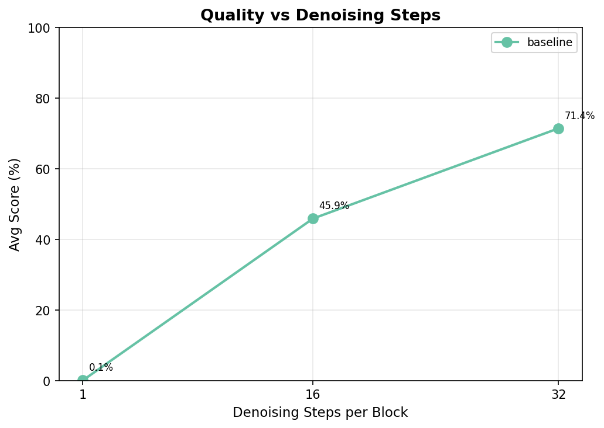

# Experiment Results — Nemotron Diffusion 3B

> Auto-updated by the agent after each evaluation. Single source of truth for comparing experiments.

## Leaderboard — 32 denoising steps per block (AR-equivalent)

| Rank | Experiment | Checkpoint | MBPP | MBPP+ | GSM8k Strict | GSM8k Flex | Avg | Date |
|------|-----------|-----------|------|-------|-------------|------------|-----|------|
| 0 | **baseline** | `ministral_3b_v3/iter_0005000` | 56.40% | 69.31% | 79.53% | 80.52% | 71.44% | 2026-04-07 |

## Leaderboard — 16 denoising steps per block

| Rank | Experiment | Checkpoint | MBPP | MBPP+ | GSM8k Strict | GSM8k Flex | Avg | Date |
|------|-----------|-----------|------|-------|-------------|------------|-----|------|
| 0 | **baseline** | `ministral_3b_v3/iter_0005000` | 20.00% | 30.16% | 66.11% | 67.32% | 45.90% | 2026-04-07 |

## Leaderboard — 1 denoising step per block

| Rank | Experiment | Checkpoint | MBPP | MBPP+ | GSM8k Strict | GSM8k Flex | Avg | Date |
|------|-----------|-----------|------|-------|-------------|------------|-----|------|
| 0 | **baseline** | `ministral_3b_v3/iter_0005000` | 0.00% | 0.00% | 0.00% | 0.38% | 0.10% | 2026-04-07 |

> **Avg** = mean of (MBPP, MBPP+, GSM8k Strict, GSM8k Flex).

## Inference Config Reference

Default eval settings from `eval_megatron.sh`:
- **Mode:** dLLM, block_length=32, temperature=0.0
- **NFE (diffusion_steps):** equals max_new_tokens per task — GSM8k: 256, MBPP/MBPP+: 512
- **Shots:** GSM8k: 8, MBPP/MBPP+: 3

## Key Takeaways

_Updated as experiments complete. Captures high-level learnings to guide future ideas._

- **Denoising steps matter dramatically:** 32 steps ≈ AR quality (71.4% avg), 16 steps drops to 45.9%, and 1 step is near-random (0.1%).
- **NFE-quality tradeoff:** Going from 32→16 steps halves compute but loses ~25% absolute accuracy. Confidence-based early exit (denoising_threshold) may recover some of this gap.

_New experiment results are appended below by the agent._
