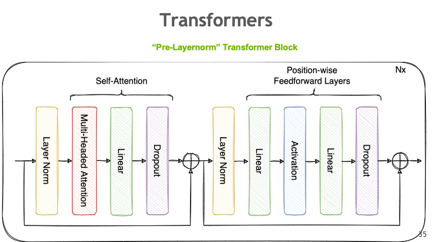
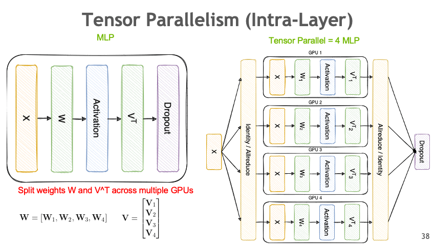
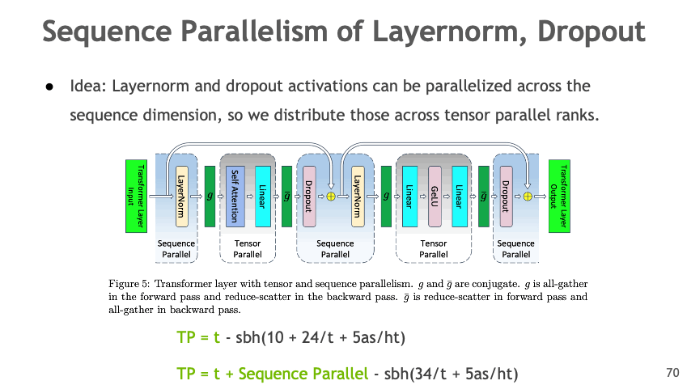

# Parallelisms Guide

Megatron Bridge supports various data-parallel and model-parallel deep learning workload deployment methods, which can be mixed together arbitrarily. These parallelism strategies are configured through model provider classes and leverage Megatron Core's implementation for performance and memory efficiency.

## Data Parallelism

Data Parallelism (DP) replicates the model across multiple GPUs. Data batches are evenly distributed between GPUs and the data-parallel GPUs process them independently. While the computation workload is efficiently distributed across GPUs, inter-GPU communication is required to keep the model replicas consistent between training steps.

### Distributed Data Parallelism

Distributed Data Parallelism (DDP) keeps the model copies consistent by synchronizing parameter gradients across data-parallel GPUs before each parameter update. More specifically, it sums the gradients of all model copies using all-reduce communication collectives.


*Figure: Distributed Data Parallelism synchronizes gradients across multiple GPUs using all-reduce operations.*

### Distributed Optimizer

[Distributed optimizer](https://docs.nvidia.com/megatron-core/developer-guide/latest/api-guide/dist_optimizer.html) is a memory-optimized data-parallel deployment method. It shards the optimizer states and the high-precision master parameters across data-parallel GPUs instead of replicating them. At the parameter optimizer step, each data-parallel GPU updates its shard of parameters. Since each GPU needs its own gradient shard, the distributed optimizer conducts reduce-scatter of the parameter gradients instead of all-reduce of them. Then, the updated parameter shards are all-gathered across data-parallel GPUs. This approach significantly reduces the memory need of large-scale LLM training.

### Enable Data Parallelism

In Megatron Bridge, DDP is the default parallel deployment method. The total number of GPUs corresponds to the size of the DP group, and training an LLM with model parallelism decreases the size of the DP group.

To enable the distributed optimizer, configure the {py:class}`bridge.training.config.OptimizerConfig` and {py:class}`bridge.training.config.DistributedDataParallelConfig`

```python
from megatron.bridge.training.config import ConfigContainer, DistributedDataParallelConfig, OptimizerConfig

optimizer_config = OptimizerConfig(
    optimizer="adam",
    lr=3e-4,
    weight_decay=0.1,
    adam_beta1=0.9,
    adam_beta2=0.95,
    use_distributed_optimizer=True,
    clip_grad=1.0,
)
ddp_config = DistributedDataParallelConfig(use_distributed_optimizer=True)

config = ConfigContainer(
    ddp=ddp_config,
    optimizer=optimizer_config,
    # ... other config parameters
)
```

For more optimizer options, refer to the {py:class}`bridge.training.config.OptimizerConfig` API documentation.

## Model Parallelism

Model Parallelism (MP) is a distributed model deployment method that partitions the model parameters across GPUs to reduce the need for per-GPU memory. Megatron Bridge supports various model-parallel methods through Megatron Core, which can be mixed to maximize LLM training performance.

### Tensor Parallelism

Tensor Parallelism (TP) is a model-parallel partitioning method that distributes the parameter tensor of an individual layer across GPUs. In addition to reducing model state memory usage, it also saves activation memory as the per-GPU tensor sizes shrink. However, the reduced per-GPU tensor size increases CPU overhead due to smaller per-GPU kernel workloads.


*Figure 1: Tensor Parallelism distributes individual layer parameters across multiple GPUs.*


*Figure 2: Detailed view of how tensor parallelism splits weight matrices and synchronizes computations.*

#### Enable Tensor Parallelism

To enable TP in Megatron Bridge, configure the `tensor_model_parallel_size` parameter in your model provider. This parameter determines the number of GPUs among which the model's tensors are partitioned.

```python
from megatron.bridge.models import GPTModelProvider
from megatron.bridge.training.config import ConfigContainer

# Configure model with tensor parallelism
model_config = GPTModelProvider(
    tensor_model_parallel_size=2,  # Enable TP across 2 GPUs
    # ... other model parameters
)

config = ConfigContainer(
    model=model_config,
    # ... other config parameters
)
```

#### Implement Tensor Parallelism

Megatron Bridge integrates TP through the implementation from Megatron Core. For detailed API usage and additional configurations, consult the [Megatron Core Developer Guide](https://docs.nvidia.com/megatron-core/developer-guide/latest/api-guide/tensor_parallel.html).

### Pipeline Parallelism

Pipeline Parallelism (PP) is a technique that assigns consecutive layers or segments of a neural network to different GPUs. This division allows each GPU to process different stages of the network sequentially.


*Figure: Pipeline Parallelism distributes consecutive layers across multiple GPUs, processing batches in a pipeline fashion.*

#### Enable Pipeline Parallelism

To utilize Pipeline Parallelism in Megatron Bridge, set the `pipeline_model_parallel_size` parameter in your model configuration. This parameter specifies the number of GPUs among which the model's layers are distributed.

```python
from megatron.bridge.models import GPTModelProvider
from megatron.bridge.training.config import ConfigContainer

# Configure model with pipeline parallelism
model_config = GPTModelProvider(
    pipeline_model_parallel_size=4,  # Distribute layers across 4 GPUs
    # ... other model parameters
)

config = ConfigContainer(
    model=model_config,
    # ... other config parameters
)
```

#### Interleaved Pipeline Parallel Schedule

To minimize the pipeline bubble, the computation on each GPU can be divided into multiple subsets of layers (referred to as model chunks), rather than a single contiguous block. Enable this by setting `virtual_pipeline_model_parallel_size`:

```python
model_config = GPTModelProvider(
    pipeline_model_parallel_size=4,
    virtual_pipeline_model_parallel_size=2,  # 2 model chunks per pipeline stage
    # ... other model parameters
)
```

For more insights into this approach, see the detailed blog: [Scaling Language Model Training](https://developer.nvidia.com/blog/scaling-language-model-training-to-a-trillion-parameters-using-megatron/#pipeline_parallelism).

#### Implement Pipeline Parallelism

The Megatron Bridge implementation of PP leverages functionalities from Megatron Core. For more detailed API usage and configurations related to PP, visit the [Megatron Core Developer Guide](https://docs.nvidia.com/Megatron-Core/developer-guide/latest/api-guide/tensor_parallel.html).

### Expert Parallelism and Mixture of Experts (MoE)

Expert Parallelism (EP) is a type of model parallelism that distributes experts of a Mixture of Experts (MoE) model across GPUs. Unlike other model-parallel techniques, EP is applied to only the expert layers and does not impact the parallel mapping of the rest of the layers.

MoE is a machine learning technique where multiple specialized models (experts, usually multi-layer perceptrons) are combined to solve a complex task. Each expert focuses on a specific subtask or domain, while a gating network dynamically activates the most appropriate expert based on the current input.


*Figure: Expert Parallelism distributes MoE experts across multiple GPUs while keeping other layers replicated.*

#### Basic MoE Configuration

To enable MoE in Megatron Bridge, configure the basic MoE parameters in your model provider:

```python
from megatron.bridge.models import GPTModelProvider

# Configure basic MoE model
model_config = GPTModelProvider(
    num_moe_experts=8,           # Number of experts in the MoE module
    moe_router_topk=2,           # Number of experts activated per token
    moe_ffn_hidden_size=8192,    # Hidden size for expert FFN layers
    # ... other model parameters
)
```

#### Enable Expert Parallelism

To enable EP, set `expert_model_parallel_size` in your model configuration. For example, if the model has eight experts (`num_moe_experts=8`), then setting `expert_model_parallel_size=4` results in each GPU processing two experts. The number of experts should be divisible by the expert parallel size.

```python
# Configure MoE model with expert parallelism
model_config = GPTModelProvider(
    num_moe_experts=8,
    expert_model_parallel_size=4,  # Distribute 8 experts across 4 GPUs (2 experts per GPU)
    # ... other model parameters
)
```

#### Enable Expert Tensor Parallelism

To enable Expert Tensor Parallelism (ETP), set `expert_tensor_parallel_size` in your model configuration:

```python
model_config = GPTModelProvider(
    num_moe_experts=8,
    expert_model_parallel_size=4,
    expert_tensor_parallel_size=2,  # Apply tensor parallelism within each expert
    # ... other model parameters
)
```

#### Advanced MoE Features

##### DeepEP Optimization

Megatron Bridge includes DeepEP optimization for improved MoE performance on Ampere and Hopper GPUs:

```python
from megatron.bridge.training.deepep import apply_deepep

# Apply DeepEP optimization
apply_deepep(model_config)  # Sets moe_token_dispatcher_type="flex" and other optimizations
```

##### Token Dropping for Load Balancing

Token dropping improves performance by balancing work across experts:

```python
from megatron.bridge.training.utils.moe_token_drop import apply_moe_token_drop

# Apply token drop settings for load balancing
apply_moe_token_drop(model_config, moe_expert_capacity_factor=1.0)
```

#### Complete MoE Configuration Example

```python
from megatron.bridge.models import GPTModelProvider
from megatron.bridge.training.config import ConfigContainer
from megatron.bridge.training.deepep import apply_deepep
from megatron.bridge.training.utils.moe_token_drop import apply_moe_token_drop

# Configure MoE model with expert parallelism
model_config = GPTModelProvider(
    num_layers=32,
    hidden_size=4096,
    num_attention_heads=32,
    
    # MoE configuration
    num_moe_experts=8,                    # 8 experts total
    moe_router_topk=2,                    # Activate 2 experts per token
    
    # Expert parallelism
    expert_model_parallel_size=4,         # Distribute experts across 4 GPUs
    expert_tensor_parallel_size=2,        # Apply TP within each expert
    
    # ... other model parameters
)

config = ConfigContainer(
    model=model_config,
    # ... other config parameters
)
```

#### Expert Parallelism Implementation

The Megatron Bridge implementation of EP uses functionality from Megatron Core. Please consult the [Megatron Core MoE layer](https://github.com/NVIDIA/Megatron-LM/blob/main/megatron/core/transformer/moe/moe_layer.py#L42) for more MoE implementation details.

## Activation Partitioning

In LLM training, a large memory space is needed to store the input activations of the network layers. Megatron Bridge provides effective activation distribution methods through Megatron Core, which is critical in training LLMs with large sequence lengths or large per-GPU micro-batch sizes.

### Sequence Parallelism

Sequence Parallelism (SP) extends tensor-level model parallelism by distributing computing load and activation memory across multiple GPUs along the sequence dimension of transformer layers. This method is particularly useful for portions of the layer that have previously not been parallelized, enhancing overall model performance and efficiency.


*Figure: Sequence Parallelism distributes the sequence dimension across multiple GPUs, reducing activation memory.*

#### Enable Sequence Parallelism

To utilize SP in Megatron Bridge, set the `sequence_parallel` parameter to `True` in your model configuration. Note that this feature is effective only when the tensor parallel size (`tensor_model_parallel_size`) is greater than `1`.

```python
from megatron.bridge.models import GPTModelProvider

# Configure model with sequence parallelism
model_config = GPTModelProvider(
    tensor_model_parallel_size=2,  # Required for sequence parallelism
    sequence_parallel=True,        # Enable sequence parallelism
    # ... other model parameters
)
```

#### Implement Sequence Parallelism

The Megatron Bridge implementation of SP utilizes functionality from Megatron Core. For an in-depth look at how Sequence Parallelism is integrated into the Megatron Core architecture, you can examine the source code: [Megatron-LM Sequence Parallel Source Code](https://github.com/NVIDIA/Megatron-LM/blob/main/megatron/core/tensor_parallel/layers.py).

### Context Parallelism

Context Parallelism (CP) is a method for parallelizing the processing of neural network activations across multiple GPUs by partitioning the input tensors along the sequence dimension. Unlike Sequence Parallelism (SP) that partitions the activations of specific layers, CP divides the activations of all layers.

CP is critical for training long context models, as it allows the model to handle longer sequences by distributing the sequence activations across multiple GPUs. This method reduces the memory footprint and computational cost of processing long sequences.

#### Enable Context Parallelism

To activate CP in Megatron Bridge, set the `context_parallel_size` parameter in your model configuration. This parameter specifies the number of GPUs across which the model's sequence activations are distributed.

```python
from megatron.bridge.models import GPTModelProvider

# Configure model with context parallelism
model_config = GPTModelProvider(
    context_parallel_size=2,  # Distribute sequence across 2 GPUs
    # ... other model parameters
)
```

For long context training scenarios, context parallelism is particularly effective and essential for handling sequences that exceed the memory capacity of individual GPUs.

#### Implement Context Parallelism

Megatron Bridge leverages functionalities from both Megatron Core and Transformer Engine to implement CP efficiently. During forward propagation, each GPU handles a segment of the sequence, storing only the necessary Key and Value (KV) pairs. In the backward pass, these KV pairs are reassembled across GPUs using advanced communication schemes like all-gather and reduce-scatter transformed into point-to-point communications in a ring topology. This method reduces the memory footprint significantly while maintaining computational efficiency.

For more detailed technical information and implementation details, visit:
- [Megatron Core Context Parallelism Documentation](https://docs.nvidia.com/megatron-core/developer-guide/latest/api-guide/context_parallel.html)
- [Megatron Core wrappers for Transformer Engine](https://github.com/NVIDIA/Megatron-LM/blob/main/megatron/core/transformer/custom_layers/transformer_engine.py)
- [Transformer Engine attention modules](https://github.com/NVIDIA/TransformerEngine/blob/main/transformer_engine/pytorch/attention.py)

## Combined Parallelism Example

Megatron Bridge allows you to combine multiple parallelism strategies for optimal performance and memory efficiency:

```python
from megatron.bridge.models import GPTModelProvider
from megatron.bridge.training.config import ConfigContainer, OptimizerConfig

# Configure model with multiple parallelism strategies
model_config = GPTModelProvider(
    # Model parallelism
    tensor_model_parallel_size=2,      # 2-way tensor parallelism
    pipeline_model_parallel_size=4,    # 4-way pipeline parallelism
    virtual_pipeline_model_parallel_size=2,  # Interleaved pipeline
    
    # Activation partitioning
    sequence_parallel=True,            # Enable sequence parallelism (requires TP > 1)
    context_parallel_size=2,           # 2-way context parallelism
    
    # Expert parallelism (for MoE models)
    num_moe_experts=8,                 # 8 experts
    expert_model_parallel_size=4,      # Distribute experts across 4 GPUs
    
    # ... other model parameters
)

# Configure distributed optimizer
optimizer_config = OptimizerConfig(
    optimizer="adam",
    use_distributed_optimizer=True,    # Enable distributed optimizer
    # ... other optimizer parameters
)

config = ConfigContainer(
    model=model_config,
    optimizer=optimizer_config,
    # ... other config parameters
)
```

## Data Parallel Size Calculation

The data parallel size is automatically calculated based on the total world size and model parallelism settings:

```
data_parallel_size = world_size / (tensor_model_parallel_size × pipeline_model_parallel_size × context_parallel_size)
```

For example, with 32 GPUs total and the configuration above:
- `tensor_model_parallel_size = 2`
- `pipeline_model_parallel_size = 4` 
- `context_parallel_size = 2`
- `data_parallel_size = 32 / (2 × 4 × 2) = 2`

## Configuration Guidelines

### Memory Optimization
- Use **distributed optimizer** to reduce optimizer state memory
- Enable **sequence parallelism** when using tensor parallelism to reduce activation memory
- Use **context parallelism** for long sequence training
- Consider **pipeline parallelism** for very large models that don't fit on a single GPU

### Performance Optimization
- **Tensor parallelism** works best within a single node (high bandwidth)
- **Pipeline parallelism** can work across nodes but requires careful batch size tuning
- **Context parallelism** is essential for long context scenarios
- **Expert parallelism** is specific to MoE models and should match the number of experts

### Compatibility
- **Sequence parallelism** requires `tensor_model_parallel_size > 1`
- **Expert parallelism** requires MoE models (`num_moe_experts > 0`)
- All parallelism strategies can be combined, but total parallelism must divide evenly into the world size

## Resources

- [Megatron Core Developer Guide](https://docs.nvidia.com/megatron-core/developer-guide/latest/)
- [Scaling Language Model Training](https://developer.nvidia.com/blog/scaling-language-model-training-to-a-trillion-parameters-using-megatron/)
- [Megatron-LM Repository](https://github.com/NVIDIA/Megatron-LM)
- [Transformer Engine](https://github.com/NVIDIA/TransformerEngine)

