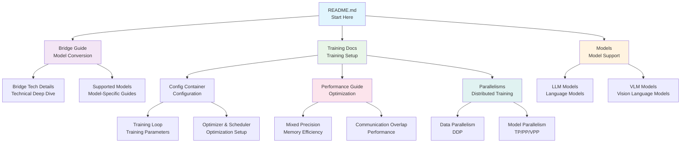

Welcome to the Megatron Bridge documentation! This guide helps you navigate our comprehensive documentation to find exactly what you need for training, converting, and working with large language models and vision language models.

## 🚀 Quick Start Paths

### I want to

**🏃‍♂️ Get started with model conversion**
→ Start with [Bridge Guide](/bridge-guide) for Hugging Face ↔ Megatron conversion

**⚡ Understand parallelisms and performance**
→ Jump to [Parallelisms Guide](/parallelisms) and [Performance Guide](/performance-guide)

**🚀 Start training a model**
→ See [Training Documentation](/training/README) for comprehensive training guides

**📚 Find model documentation**
→ Browse [Supported Models](/models/llm/index) for LLMs or [Vision Language Models](/models/vlm/index) for VLMs

**🔧 Migrate from NeMo 2 or Megatron-LM**
→ Check [NeMo 2 Migration Guide](/nemo2-migration-guide) or [Megatron-LM Migration Guide](/megatron-lm-to-megatron-bridge)

**📊 Use training recipes**
→ Read [Recipe Usage](/recipe-usage) for pre-configured training recipes

**🔌 Add support for a new model**
→ Refer to [Adding New Models](/adding-new-models)

**📋 Check version information**
→ See [Releases Documentation](/releases/README) for versions, changelog, and known issues

---

## 👥 Documentation by Role

### For ML Engineers & Researchers

- **Start here:** [Bridge Guide](/bridge-guide) → [Training Documentation](/training/README)
- **Deep dive:** [Performance Guide](/performance-guide) → [Training Optimization Guides](/training/README#optimization-and-performance)
- **Model support:** [Supported Models](/models/llm/index) → [Adding New Models](/adding-new-models)

### For Training Engineers

- **Start here:** [Training Documentation](/training/README) → [Configuration Container Overview](/training/config-container-overview)
- **Performance:** [Performance Guide](/performance-guide) → [Performance Summary](/performance-summary)
- **Parallelisms:** [Parallelisms Guide](/parallelisms) → [Training Optimization](/training/README#optimization-and-performance)

### For Model Developers

- **Start here:** [Bridge Guide](/bridge-guide) → [Bridge Tech Details](/bridge-tech-details)
- **Model support:** [Adding New Models](/adding-new-models) → [Model Documentation](/models/llm/index)
- **Integration:** [Bridge RL Integration](/bridge-rl-integration)

### For DevOps & Platform Teams

- **Start here:** [Releases Documentation](/releases/README) → [Software Versions](/releases/software-versions)
- **Troubleshooting:** [Known Issues](/releases/known-issues)
- **API Reference:** [API Documentation](/apidocs/index.rst)

---

## 📚 Complete Documentation Index

### Getting Started

| Document | Purpose | When to Read |
|----------|---------|--------------|
| **[Bridge Guide](/bridge-guide)** | Hugging Face ↔ Megatron conversion guide | First time converting models |
| **[Bridge Tech Details](/bridge-tech-details)** | Technical details of the bridge system | Understanding bridge internals |
| **[Parallelisms Guide](/parallelisms)** | Data and model parallelism strategies | Setting up distributed training |
| **[Performance Summary](/performance-summary)** | Quick performance reference | Quick performance lookup |
| **[Performance Guide](/performance-guide)** | Comprehensive performance optimization | Optimizing training performance |

### Model Support

| Document | Purpose | When to Read |
|----------|---------|--------------|
| **[Large Language Models](/models/llm/index)** | LLM model documentation | Working with LLM models |
| **[Vision Language Models](/models/vlm/index)** | VLM model documentation | Working with VLM models |
| **[Adding New Models](/adding-new-models)** | Guide for adding model support | Extending model support |

### Training and Customization

| Document | Purpose | When to Read |
|----------|---------|--------------|
| **[Training Documentation](/training/README)** | Comprehensive training guides | Setting up and customizing training |
| **[Configuration Container Overview](/training/config-container-overview)** | Central training configuration | Understanding training configuration |
| **[Entry Points](/training/entry-points)** | Training entry points and execution | Understanding training flow |
| **[Training Loop Settings](/training/training-loop-settings)** | Training loop parameters | Configuring training parameters |
| **[Optimizer & Scheduler](/training/optimizer-scheduler)** | Optimization configuration | Setting up optimizers |
| **[Mixed Precision](/training/mixed-precision)** | Mixed precision training | Reducing memory usage |
| **[PEFT](/training/peft)** | Parameter-efficient fine-tuning | Fine-tuning with limited resources |
| **[Checkpointing](/training/checkpointing)** | Checkpoint management | Saving and resuming training |
| **[Logging](/training/logging)** | Logging and monitoring | Monitoring training progress |
| **[Profiling](/training/profiling)** | Performance profiling | Identifying bottlenecks |

### Recipes and Workflows

| Document | Purpose | When to Read |
|----------|---------|--------------|
| **[Recipe Usage](/recipe-usage)** | Using pre-configured training recipes | Quick training setup |
| **[Bridge RL Integration](/bridge-rl-integration)** | Reinforcement learning integration | RL training workflows |

### Migration Guides

| Document | Purpose | When to Read |
|----------|---------|--------------|
| **[NeMo 2 Migration Guide](/nemo2-migration-guide)** | Migrating from NeMo 2 | Upgrading from NeMo 2 |
| **[Megatron-LM Migration Guide](/megatron-lm-to-megatron-bridge)** | Migrating from Megatron-LM | Upgrading from Megatron-LM |

### Reference

| Document | Purpose | When to Read |
|----------|---------|--------------|
| **[API Documentation](/apidocs/index.rst)** | Complete API reference | Building integrations |
| **[Releases Documentation](/releases/README)** | Version history and known issues | Checking versions, troubleshooting |
| **[Documentation Guide](/documentation)** | Contributing to documentation | Contributing docs |

---

## 🗺️ Common Reading Paths

### 🆕 First-Time Users

1. [Bridge Guide](/bridge-guide) *(10 min - understand conversion)*
2. [Parallelisms Guide](/parallelisms) *(15 min - understand distributed training)*
3. [Training Documentation](/training/README) *(choose your training path)*
4. [Recipe Usage](/recipe-usage) *(5 min - use pre-configured recipes)*

### 🔧 Setting Up Training

1. [Training Documentation](/training/README) *(overview of training system)*
2. [Configuration Container Overview](/training/config-container-overview) *(understand configuration)*
3. [Entry Points](/training/entry-points) *(how training starts)*
4. [Training Loop Settings](/training/training-loop-settings) *(configure parameters)*
5. [Logging](/training/logging) *(set up monitoring)*

### ⚡ Performance Optimization

1. [Performance Guide](/performance-guide) *(comprehensive optimization strategies)*
2. [Performance Summary](/performance-summary) *(quick reference)*
3. [Mixed Precision](/training/mixed-precision) *(reduce memory usage)*
4. [Communication Overlap](/training/communication-overlap) *(optimize distributed training)*
5. [Activation Recomputation](/training/activation-recomputation) *(reduce memory footprint)*
6. [Profiling](/training/profiling) *(identify bottlenecks)*

### 🔄 Model Conversion Workflow

1. [Bridge Guide](/bridge-guide) *(conversion basics)*
2. [Bridge Tech Details](/bridge-tech-details) *(technical details)*
3. [Supported Models](/models/llm/index) or [Vision Language Models](/models/vlm/index) *(model-specific guides)*
4. [Adding New Models](/adding-new-models) *(extend support)*

### 🔧 Customization and Extension

1. [Training Documentation](/training/README) *(training customization)*
2. [PEFT](/training/peft) *(parameter-efficient fine-tuning)*
3. [Distillation](/training/distillation) *(knowledge distillation)*
4. [Adding New Models](/adding-new-models) *(add model support)*
5. [Bridge RL Integration](/bridge-rl-integration) *(RL workflows)*

### 📦 Migration Paths

1. [NeMo 2 Migration Guide](/nemo2-migration-guide) *(from NeMo 2)*
2. [Megatron-LM Migration Guide](/megatron-lm-to-megatron-bridge) *(from Megatron-LM)*
3. [Training Documentation](/training/README) *(new training system)*

---

## 📁 Directory Structure

### Main Documentation

- **Guides** - Core guides for parallelisms, performance, recipes, and migration
- **Bridge Documentation** - Hugging Face ↔ Megatron conversion guides
- **Model Documentation** - Supported model families and architectures

### Subdirectories

#### [models/](/models/README)

- **[llm/](/models/llm/README)** - Large Language Model documentation
  - Individual model guides (Qwen, LLaMA, Mistral, etc.)
  - Conversion examples and training recipes
- **[vlm/](/models/vlm/README)** - Vision Language Model documentation
  - VLM model guides (Qwen VL, Gemma VL, etc.)
  - Multimodal model support

#### [training/](/training/README)

- **Configuration** - ConfigContainer, entry points, training loop settings
- **Optimization** - Optimizer, scheduler, mixed precision, communication overlap
- **Performance** - Attention optimizations, activation recomputation, CPU offloading
- **Monitoring** - Logging, profiling, checkpointing, resiliency
- **Advanced** - PEFT, packed sequences, distillation

#### [releases/](/releases/README)

- **Software Versions** - Current versions and dependencies
- **Changelog** - Release history and changes
- **Known Issues** - Bugs, limitations, and workarounds

---

## 🔗 How Documents Connect

---

## 🤝 Getting Help

- **GitHub Issues:** [Report bugs or request features](https://github.com/NVIDIA-NeMo/Megatron-Bridge/issues)
- **Documentation Issues:** Found something unclear? Let us know!
- **Community:** Join discussions and share experiences

---

## 📖 Additional Resources

- **[Examples](https://github.com/NVIDIA-NeMo/Megatron-Bridge/tree/main/examples)** - Code examples and tutorials
- **[Contributing Guide](https://github.com/NVIDIA-NeMo/Megatron-Bridge/blob/main/CONTRIBUTING.md)** - How to contribute to the project
- **[API Documentation](/apidocs/index.rst)** - Complete API reference

---

**Ready to get started?** Choose your path above or dive into the [Bridge Guide](/bridge-guide) for model conversion! 🚀
