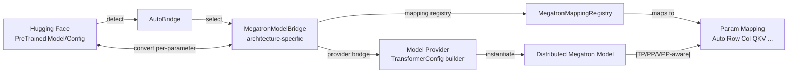
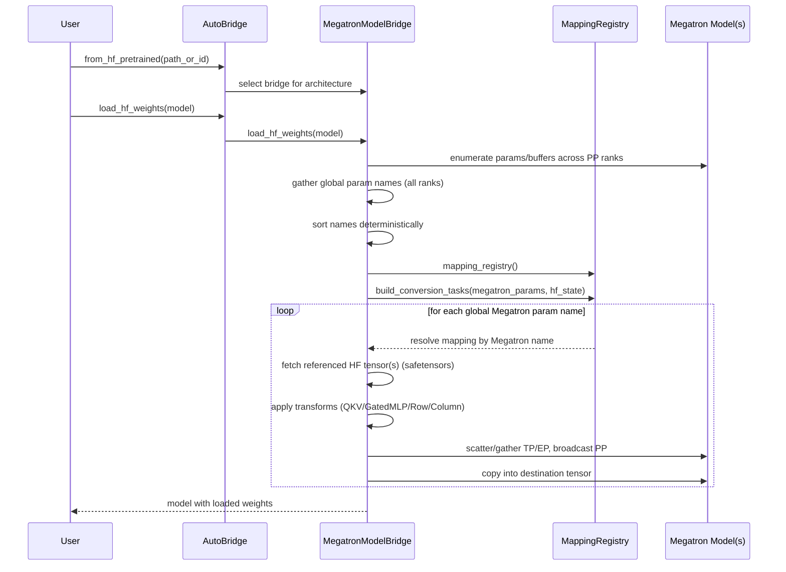
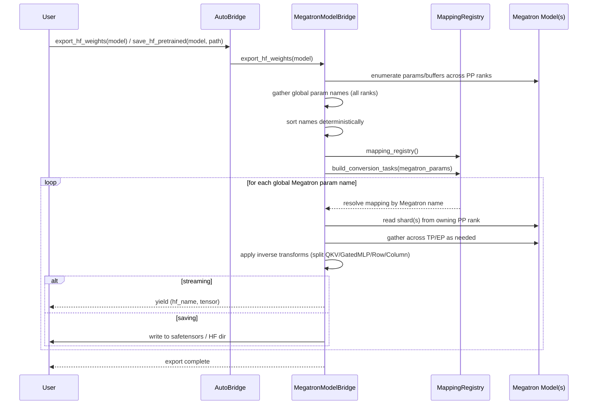

Megatron Bridge provides a robust, parallelism-aware pathway to convert models and checkpoints between 🤗 Hugging Face Transformers and Megatron-Core formats. This page dives into the architecture, data flows, and per-parameter conversion engine, with examples.

Megatron Bridge performs on-the-fly, model-parallel-aware, per-parameter conversion—unlike traditional converters that require a single GPU and full in-memory loading of both Megatron-Core and HF models.

- For API-centric usage, see the guide: [Bridge with 🤗 Hugging Face](/./bridge-guide)

## Architecture at a glance



Key components:

- AutoBridge: Detects HF architecture, constructs the appropriate bridge, exposes high-level convert/save APIs. See [API Documentation](https://docs.nvidia.com/nemo/megatron-bridge/latest/apidocs/).
- MegatronModelBridge: Orchestrates conversion, builds conversion tasks, handles per-parameter streaming. See [model_bridge.py](https://github.com/NVIDIA-NeMo/Megatron-Bridge/tree/main/src/megatron/bridge/models/conversion/model_bridge.py).
- MegatronMappingRegistry: Registry of parameter-name mappings; resolves concrete `MegatronParamMapping` for each weight. See [mapping_registry.py](https://github.com/NVIDIA-NeMo/Megatron-Bridge/tree/main/src/megatron/bridge/models/conversion/mapping_registry.py).
- Param Mappings: Implement parameter transformations and parallel distribution (Auto, ColumnParallel, RowParallel, QKV, GatedMLP, Replicated, custom). See [param_mapping.py](https://github.com/NVIDIA-NeMo/Megatron-Bridge/tree/main/src/megatron/bridge/models/conversion/param_mapping.py).
- Model Providers: Build `TransformerConfig`-compatible providers for Megatron-Core and instantiate distributed models. See [models/](https://github.com/NVIDIA-NeMo/Megatron-Bridge/tree/main/src/megatron/bridge/models).
- Specific model bridge definitions: Architecture-specific bridges live under their model folders, for example [LlamaBridge](https://github.com/NVIDIA-NeMo/Megatron-Bridge/tree/main/src/megatron/bridge/models/llama/llama_bridge.py) and [Qwen3Bridge](https://github.com/NVIDIA-NeMo/Megatron-Bridge/tree/main/src/megatron/bridge/models/qwen/qwen3_bridge.py).

## Conversion workflow

The conversion engine is powered by two pieces: the architecture-specific Megatron model bridge and the parameter mappings.

(1) Config mapping + model creation: You specify a config mapping and parameter mapping strategy (name patterns + mapping types). The bridge loads the HF config, translates it into a Megatron provider, and the provider instantiates a (possibly distributed) Megatron model. With TP/PP/EP enabled, each rank holds only a shard of the model.

```python
from megatron.bridge import AutoBridge

# Build bridge and instantiate Megatron model(s)
bridge = AutoBridge.from_hf_pretrained("meta-llama/Llama-3.2-1B")
provider = bridge.to_megatron_provider()
provider.finalize()
megatron_model = provider.provide_distributed_model(wrap_with_ddp=False)
```

(2) Gather all params: After the model is created, the bridge enumerates all named parameters and buffers across PP ranks. It then sorts them to produce a deterministic global order, ensuring every rank uses the same mapping order for collective operations during conversion.

(3) Resolve mappings: Using the global Megatron parameter names, the bridge queries the mapping registry to resolve a concrete mapping per parameter. For example, in Qwen3, `decoder.layers.0.self_attention.linear_qkv.weight` matches a `QKVMapping` pattern. Resolution always starts from the Megatron name; HF names are derived via wildcard substitution. Only the referenced HF tensors are fetched from safetensors—the full HF model is never fully loaded.

```python
from megatron.bridge.models.conversion.mapping_registry import MegatronMappingRegistry
from megatron.bridge.models.conversion.param_mapping import AutoMapping, QKVMapping

registry = MegatronMappingRegistry(
    AutoMapping(
        megatron_param="decoder.layers.*.mlp.linear_fc2.weight",
        hf_param="model.layers.*.mlp.down_proj.weight",
    ),
    QKVMapping(
        megatron_param="decoder.layers.*.self_attention.linear_qkv.weight",
        q="model.layers.*.self_attn.q_proj.weight",
        k="model.layers.*.self_attn.k_proj.weight",
        v="model.layers.*.self_attn.v_proj.weight",
    ),
)
# Example: "decoder.layers.0.self_attention.linear_qkv.weight" → QKVMapping
```

(4) Create conversion tasks: The bridge pairs every Megatron parameter with its resolved mapping and associated metadata (owning module, tensor handle, parallelism context). These per-parameter tasks become the unit of work for conversion.

(5) Execute conversions: For HF→Megatron or Megatron→HF, the bridge iterates tasks and calls the mapping’s `hf_to_megatron` or `megatron_to_hf` routines. Conversion streams parameter-by-parameter to minimize memory.

```python
# HF → Megatron streaming import (internally iterates conversion tasks)
bridge.load_hf_weights(megatron_model)
```

(6) Mapping semantics: Each mapping handles the necessary distribution logic—broadcasting across PP, scattering/gathering across TP/EP—and applies structural transforms (e.g., QKV fuse/split, gated-MLP concat/split, row/column parallel splits).

Properties:

- Per-parameter streaming: Only the weight currently being processed is kept in memory.
- Parallelism aware: Distribution respects TP (tensor), PP (pipeline), VPP (virtual pipeline), and expert parallel settings.
- Deterministic mapping: Names resolve via `MegatronMappingRegistry`, including wildcard support.

### HF → Megatron (import)



### Megatron → HF (export)



## Param mappings and parallelism

Mapping types available via [param_mapping.py](https://github.com/NVIDIA-NeMo/Megatron-Bridge/tree/main/src/megatron/bridge/models/conversion/param_mapping.py):

- AutoMapping: General-purpose 1:1 parameter mapping with automatic TP-type detection; dispatches to ColumnParallelMapping, RowParallelMapping, or ReplicatedMapping based on the layer/module type (wildcards supported). Participates in PP broadcast and EP gather when applicable.
- ColumnParallelMapping: Splits along the output dimension (dim 0) under TP. Participates in PP broadcast and EP gather when applicable.
- RowParallelMapping: Splits along the input dimension (dim 1) under TP. Participates in PP broadcast and EP gather when applicable.
- QKVMapping: Fuses/splits HF Q, K, V projections to Megatron's interleaved QKV format and vice versa. Uses PP broadcast as needed and delegates TP to the underlying mapping.
- GatedMLPMapping: Concatenates/splits gate and up projections. Participates in PP broadcast and EP gather when applicable.
- ReplicatedMapping: Keeps parameters fully replicated across TP ranks (e.g., LayerNorm). Participates in PP broadcast and EP gather when applicable.

Note: If you need a one-to-many or many-to-one mapping that is not covered by QKVMapping or GatedMLPMapping, implement a custom mapping.

### Example Mapping - ColumnParallelMapping: PP, TP, EP in practice

- HF → Megatron (import):
  - HF tensors are available from storage to all ranks; TP rank 0 reads the full tensor and performs the split/scatter.
  - TP: Rank 0 splits along dim 0 into `tp_size` chunks and scatters shards to TP ranks so each rank receives a tensor matching its local parameter shape/dtype/device.
  - PP: No PP collectives are needed; the owning PP stage writes its shard directly.
  - EP: For expert parameters, each EP rank receives its local experts by name; no cross-EP collectives are required on import.

- Megatron → HF (export):
  - Only the owning PP stage initially holds the local Megatron shard; it broadcasts to all PP ranks before TP gather.
  - PP: The owning PP stage first broadcasts the tensor to all PP ranks so every rank participates in the collectives.
  - TP: All TP shards are gathered and concatenated along dim 0 to reconstruct the full tensor.
  - EP: For expert parameters, shards are gathered across EP ranks and one HF tensor per expert is emitted with the correct names.
    - Let total experts be E and EP size be S (assume E % S == 0). Each EP rank owns E/S experts. For a given local expert index L on each EP rank, the global expert ids are L, L+E/S, ..., L+(S-1)*E/S. We gather tensors from all EP ranks and emit one HF tensor per global expert id by substituting that id into the HF parameter name.

This mirrors [ColumnParallelMapping.hf_to_megatron](https://github.com/NVIDIA-NeMo/Megatron-Bridge/tree/main/src/megatron/bridge/models/conversion/param_mapping.py) and [ColumnParallelMapping.megatron_to_hf](https://github.com/NVIDIA-NeMo/Megatron-Bridge/tree/main/src/megatron/bridge/models/conversion/param_mapping.py) in [param_mapping.py](https://github.com/NVIDIA-NeMo/Megatron-Bridge/tree/main/src/megatron/bridge/models/conversion/param_mapping.py).

Implementation notes (from code):
- Dtype handling: When HF and Megatron dtypes differ, weights are cast to the Megatron parameter dtype with a warning before TP scatter (see ColumnParallelMapping.hf_to_megatron in [param_mapping.py](https://github.com/NVIDIA-NeMo/Megatron-Bridge/tree/main/src/megatron/bridge/models/conversion/param_mapping.py)).
- FP8 export: Tensors are dequantized on export when using FP8 tensor classes (see `maybe_dequantize` in [param_mapping.py](https://github.com/NVIDIA-NeMo/Megatron-Bridge/tree/main/src/megatron/bridge/models/conversion/param_mapping.py)).
- MoE experts: Expert parameter names are normalized for lookup and expert shards are gathered across EP ranks and re-emitted per global expert id (see `gather_from_ep_ranks` in [param_mapping.py](https://github.com/NVIDIA-NeMo/Megatron-Bridge/tree/main/src/megatron/bridge/models/conversion/param_mapping.py)).

## Architecture-specific bridge example: Qwen3

Embedded from `src/megatron/bridge/models/qwen/qwen3_bridge.py`:

```python
# Copyright (c) 2025, NVIDIA CORPORATION.  All rights reserved.
#
# Licensed under the Apache License, Version 2.0 (the "License");
# you may not use this file except in compliance with the License.
# You may obtain a copy of the License at
#
#     http://www.apache.org/licenses/LICENSE-2.0
#
# Unless required by applicable law or agreed to in writing, software
# distributed under the License is distributed on an "AS IS" BASIS,
# WITHOUT WARRANTIES OR CONDITIONS OF ANY KIND, either express or implied.
# See the License for the specific language governing permissions and
# limitations under the License.

import torch
from megatron.core.models.gpt.gpt_model import GPTModel
from transformers import Qwen3ForCausalLM

from megatron.bridge.models.conversion.mapping_registry import MegatronMappingRegistry
from megatron.bridge.models.conversion.model_bridge import MegatronModelBridge
from megatron.bridge.models.conversion.param_mapping import (
    AutoMapping,
    GatedMLPMapping,
    QKVMapping,
)

@MegatronModelBridge.register_bridge(source=Qwen3ForCausalLM, target=GPTModel, model_type="qwen3")
class Qwen3Bridge(MegatronModelBridge):
    """
    Megatron Bridge for Qwen3 Causal LM.

    This bridge handles the conversion between HuggingFace Qwen3ForCausalLM
    and Megatron-Core GPTModel formats. Qwen3 differs from Qwen2 by using
    QK layernorm and no QKV bias.

    Example:
        >>> from megatron.bridge import AutoBridge
        >>> bridge = AutoBridge.from_hf_pretrained("Qwen/Qwen3-1.7B")
        >>> provider = bridge.to_megatron_provider()
    """

    def provider_bridge(self, hf_pretrained):
        """Convert HuggingFace Qwen3 config to GPTModelProvider."""
        provider = super().provider_bridge(hf_pretrained)

        provider.normalization = "RMSNorm"
        provider.gated_linear_unit = True
        provider.position_embedding_type = "rope"
        provider.add_bias_linear = False
        provider.add_qkv_bias = False  # Qwen3 does NOT have QKV bias (unlike Qwen2)
        provider.hidden_dropout = 0.0
        provider.qk_layernorm = True  # Qwen3 uses QK layernorm
        provider.autocast_dtype = torch.bfloat16

        return provider

    def mapping_registry(self) -> MegatronMappingRegistry:
        # Return MegatronMappingRegistry containing parameter mappings from Megatron to HF format
        # First create simple 1:1 parameter mappings using a dictionary for readability

        # Dictionary maps Megatron parameter names -> HF parameter names
        # Supports wildcard (*) patterns for layer-specific parameters
        param_mappings = {
            "embedding.word_embeddings.weight": "model.embed_tokens.weight",
            "output_layer.weight": "lm_head.weight",
            "decoder.final_layernorm.weight": "model.norm.weight",
            "decoder.layers.*.self_attention.linear_qkv.layer_norm_weight": "model.layers.*.input_layernorm.weight",
            "decoder.layers.*.mlp.linear_fc1.layer_norm_weight": "model.layers.*.post_attention_layernorm.weight",
            "decoder.layers.*.self_attention.q_layernorm.weight": "model.layers.*.self_attn.q_norm.weight",  # Qwen3 specific
            "decoder.layers.*.self_attention.k_layernorm.weight": "model.layers.*.self_attn.k_norm.weight",  # Qwen3 specific
            "decoder.layers.*.self_attention.linear_proj.weight": "model.layers.*.self_attn.o_proj.weight",
            "decoder.layers.*.mlp.linear_fc2.weight": "model.layers.*.mlp.down_proj.weight",
        }

        mapping_list = []
        # Convert each dictionary entry to AutoMapping(megatron_param, hf_param)
        for megatron_param, hf_param in param_mappings.items():
            mapping_list.append(AutoMapping(megatron_param=megatron_param, hf_param=hf_param))

        # Add special mappings that require parameter concatenation/transformation
        mapping_list.extend(
            [
                # QKV: Combine separate Q, K, V matrices into single QKV matrix
                # Note: Qwen3 does NOT have bias in QKV projections (unlike Qwen2)
                QKVMapping(
                    megatron_param="decoder.layers.*.self_attention.linear_qkv.weight",
                    q="model.layers.*.self_attn.q_proj.weight",
                    k="model.layers.*.self_attn.k_proj.weight",
                    v="model.layers.*.self_attn.v_proj.weight",
                ),
                # Gated MLP: Combine gate and up projection matrices into single FC1 matrix
                GatedMLPMapping(
                    megatron_param="decoder.layers.*.mlp.linear_fc1.weight",
                    gate="model.layers.*.mlp.gate_proj.weight",
                    up="model.layers.*.mlp.up_proj.weight",
                ),
            ]
        )

        return MegatronMappingRegistry(*mapping_list)

```

Notes:

- `provider_bridge`: Translate HF config into a Megatron-compatible provider, including architecture quirks (e.g., `qk_layernorm=True`).
- `mapping_registry`: Define exact name patterns and transformation mappings. Wildcards `*` apply the same rule across layers.
